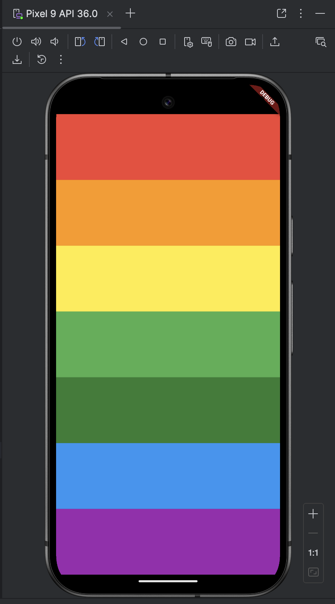
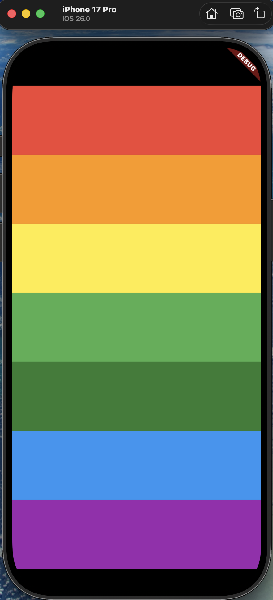

# 🎹 Xylophone Flutter App


Welcome to the **Xylophone** app! Because who said you need to carry a bulky wooden instrument to make sweet, sweet music? 🎶

Turn your phone into a colorful musical instrument and annoy your friends (or serenade them) with your beautiful compositions. Whether you're a prodigy or just like tapping bright colors, this app is for you!

## ✨ Features

*   **7 Colorful Keys**: A rainbow of musical possibilities at your fingertips. 🌈
*   **Instant Sound**: Tap a color, hear a note. Low latency for high-speed solos.
*   **Cross-Platform**: Works on Android and iOS. Jam anywhere!

## 📱 Screenshots

See the magic in action:

|                  Android                  |                iOS                |
|:-----------------------------------------:|:---------------------------------:|
|  |  |
|          *Look at those colors!*          |       *Elegant and simple.*       |

*(Note: Replace `path/to/...` with your actual screenshot paths)*

## 🛠️ How it works

This app uses the power of **Flutter** to render the UI and the [audioplayers](https://pub.dev/packages/audioplayers) package to handle the audio playback.

The logic is simple:
1.  We build 7 `Expanded` widgets (the keys).
2.  Each key is assigned a specific color and a sound file (`note1.wav` through `note7.wav`).
3.  When you tap a key, `audioplayers` kicks in and plays the corresponding note.

## 🚀 Getting Started

1.  **Clone the repo:**
    ```bash
    git clone https://github.com/yourusername/xylophone.git
    ```
2.  **Install dependencies:**
    ```bash
    flutter pub get
    ```
3.  **Run the app:**
    ```bash
    flutter run
    ```

## 📦 Dependencies

*   [flutter](https://flutter.dev/)
*   [audioplayers](https://pub.dev/packages/audioplayers)

---

Made with ❤️ and Flutter.
